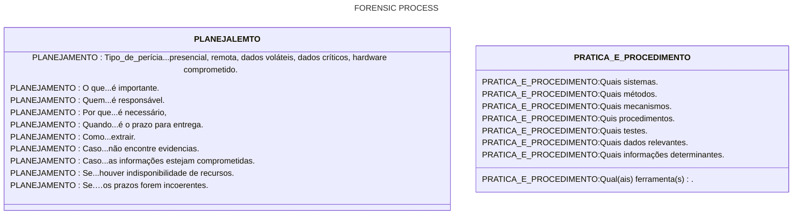

# framwork-forensic
Sugestão de processos a serem definidos e aplicado para criação da base de conhecimento aplicada a computação fosense.

```mermaid
---
title: FORENSIC PROCESS
---
classDiagram

class PLANEJALEMTO{
PLANEJAMENTO : Tipo_de_perícia...presencial, remota, dados voláteis, dados críticos, hardware comprometido.
PLANEJAMENTO : O que...é importante.
PLANEJAMENTO : Quem...é responsável.
PLANEJAMENTO : Por que...é necessário,
PLANEJAMENTO : Quando...é o prazo para entrega.
PLANEJAMENTO : Como...extrair.
PLANEJAMENTO : Caso...não encontre evidencias.
PLANEJAMENTO : Caso...as informações estejam comprometidas. 
PLANEJAMENTO : Se...houver indisponibilidade de recursos. 
PLANEJAMENTO : Se.…os prazos forem incoerentes. 
}

class PRATICA_E_PROCEDIMENTO {
PRATICA_E_PROCEDIMENTO:Qual(ais) ferramenta(s). 
PRATICA_E_PROCEDIMENTO:Quais sistemas.
PRATICA_E_PROCEDIMENTO:Quais métodos.
PRATICA_E_PROCEDIMENTO:Quais mecanismos.
PRATICA_E_PROCEDIMENTO:Quis procedimentos.
PRATICA_E_PROCEDIMENTO:Quais testes.
PRATICA_E_PROCEDIMENTO:Quais dados relevantes. 
PRATICA_E_PROCEDIMENTO:Quais informações determinantes. 

}


```
